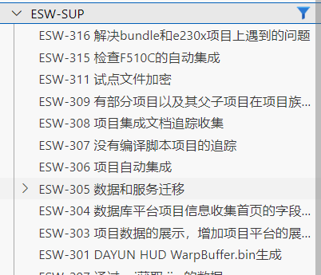
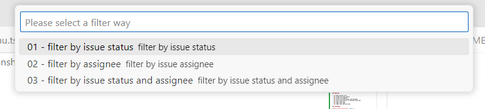
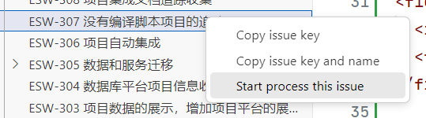

# ESW Jira Plugin

## Preparation

- Jira base url
- Jira account email
- Jira apiToken

> How to get apiToken?
>  Visit this [link](https://id.atlassian.com/manage-profile/security/api-tokens) and generate your own apiToken.

## Usage

1. <kbd>Ctrl</kbd>+<kbd>Shift</kbd>+<kbd>P</kbd> to open the command menu.
1. Input and select `ESW Jira:ESW Jira:Login`.
1. Input your personal info.

## Features

- [x] Show project list.
- [x] Filter by issue status
- [x] Filter by assignee
- [x] Filter by issue status and assignee
- [x] Auto switch branch to selected issue key
- [x] Copy issue key
- [x] Copy issue name
- [x] Copy issue key and name

## Screenshot

<figure style="text-align: center;">
  
  <figcaption >Show Project List</figcaption>
</figure>

<figure style="text-align: center;">
  
  <figcaption>Project Filter</figcaption>
</figure>

<figure style="text-align: center;">
  
  <figcaption>Issue Menu</figcaption>
</figure>

## Author

@tohsaka888 ESW-SUP-sdd1whu
@wangshiyi234 ESW-SUP-wsy1whu
